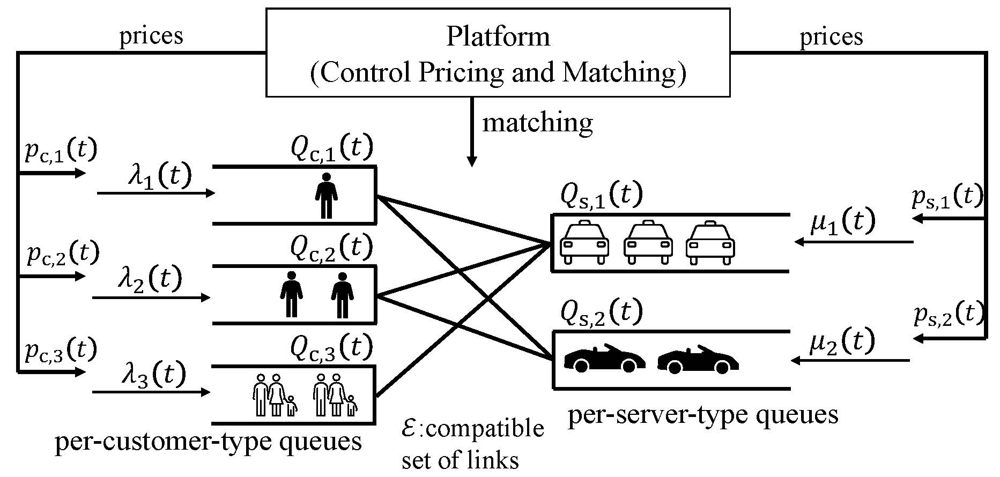

# Near-Optimal Regret-Queue Length Tradeoff in Online Learning for Two-Sided Markets

This repository is the official implementation of [Near-Optimal Regret-Queue Length Tradeoff in Online Learning for Two-Sided Markets](https://arxiv.org/abs/2510.14097). 



## Requirements

To install requirements:

Install Python 3.10 and
```setup
pip install -r requirements.txt
```

## Simulation Commands

To generate the figures in the simulation part or the appendix part of the paper, you need to first run the commands for simulation and then run the corresponding "plotfig_*.py" file for plotting figures.
The output figures will be saved to PDF files in the folders "results_single" and "results_multi".
All the commands are presented in the following for different settings.

### Single-Link System

First run the following commands for different algorithms in the single-link system:

|                                  Method                                   | Command                                                              |
|:-------------------------------------------------------------------------:|----------------------------------------------------------------------|
|                 Probabilistic two-price policy (Proposed)                 | ```python main_single_queue.py --policy "learn_two_price_threshold"``` |
| Two-price policy - known demand and supply functions (Varma et al., 2023) | ```python main_single_queue.py --policy "known_two_price"```           |
|                   Threshold policy (Yang & Ying, 2024)                    | ```python main_single_queue.py --policy "learn_threshold"```           |
|      Probabilistic two-price policy (Proposed) for different epsilon      | ```sh run_sim_single_queue_epsilon.sh```                             |
|       Probabilistic two-price policy (Proposed) for different delta       | ```sh run_sim_single_queue_delta.sh```                               |
|        Probabilistic two-price policy (Proposed) for different eta        | ```sh run_sim_single_queue_eta.sh```                                 |
|       Probabilistic two-price policy (Proposed) for different alpha       | ```sh run_sim_single_queue_alpha.sh```                               |

Run the following command to plot Figure 2 in the paper.
```bash
python plotfigs_comp_single.py --holding_cost 0.001
```

Run the following command to plot Figure 3 in the paper.
```bash
python plotfigs_comp_single.py --holding_cost 0.01
```

Run the following command to plot Figure 4 in the paper.
```bash
python plotfigs_single.py
```

Run the following command to plot Figure 5 in the paper.
```bash
python plotfigs_tradeoff_single.py
```

Run the following command to calculate the fitted functions of the regret curve and the queue length curve in Figure 5 in the paper. 
```bash
python least_square_fitting.py --policy "learn_two_price_threshold"
```

Run the following command to plot Figures 6,7,8 in the paper.
```bash
python plotfigs_para_single.py --parameter "epsilon_scaling"
python plotfigs_para_single.py --parameter "delta_scaling"
python plotfigs_para_single.py --parameter "eta_scaling"
```


### Multi-Link System

First run the following commands for different algorithms in the multi-link system:

|                                  Method                                   | Command                                                              |
|:-------------------------------------------------------------------------:|----------------------------------------------------------------------|
|                 Probabilistic two-price policy (Proposed)                 | ```python main_multi_queue.py --policy "learn_two_price_threshold"``` |
| Two-price policy - known demand and supply functions (Varma et al., 2023) | ```python main_multi_queue.py --policy "known_two_price"```           |
|                   Threshold policy (Yang & Ying, 2024)                    | ```python main_multi_queue.py --policy "learn_threshold"```           |

Run the following command to plot Figures 9,10,11 in the paper.
```bash
python plotfigs_comp_multi.py --holding_cost 0.01
python plotfigs_comp_multi.py --holding_cost 0.005
python plotfigs_comp_multi.py --holding_cost 0.001
```

Run the following command to plot Figure 12 in the paper.
```bash
python plotfigs_multi.py
```

## Results

All the results can be found in "5 Numerical Results" in the main text of the paper
and also in "H Details of the Simulation and Additional Numerical Results" in Appendix. 


## Contributing

If you'd like to contribute, you can contact us at zixian@umich.edu or open an issue on this GitHub repository.

All content in this repository is licensed under the MIT license.


## Reference

[1] Sushil Mahavir Varma, Pornpawee Bumpensanti, Siva Theja Maguluri, and He Wang. Dynamic pricing and matching for two-sided queues. Operations Research, 71(1):83–100, 2023.

[2] Zixian Yang and Lei Ying. Learning-based pricing and matching for two-sided queues. arXiv preprint arXiv:2403.11093, 2024.

